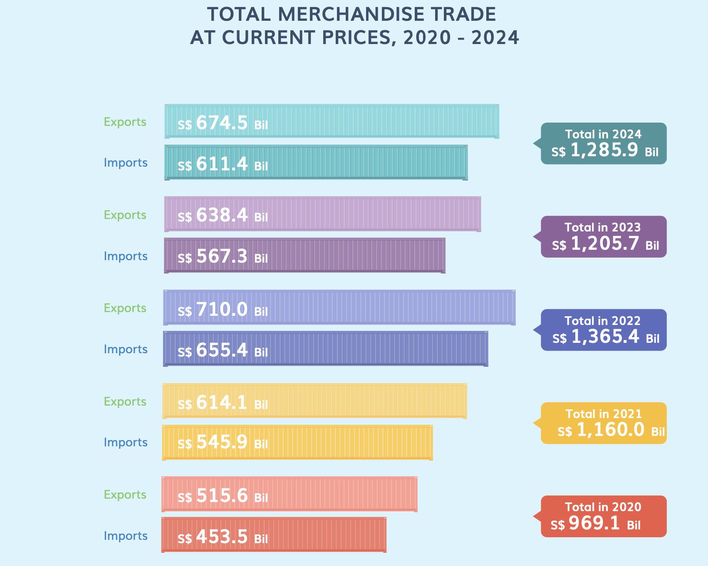
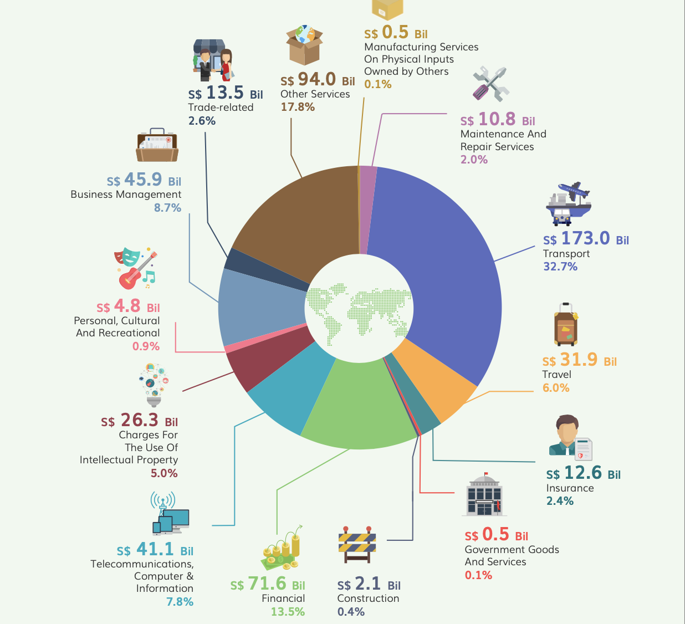
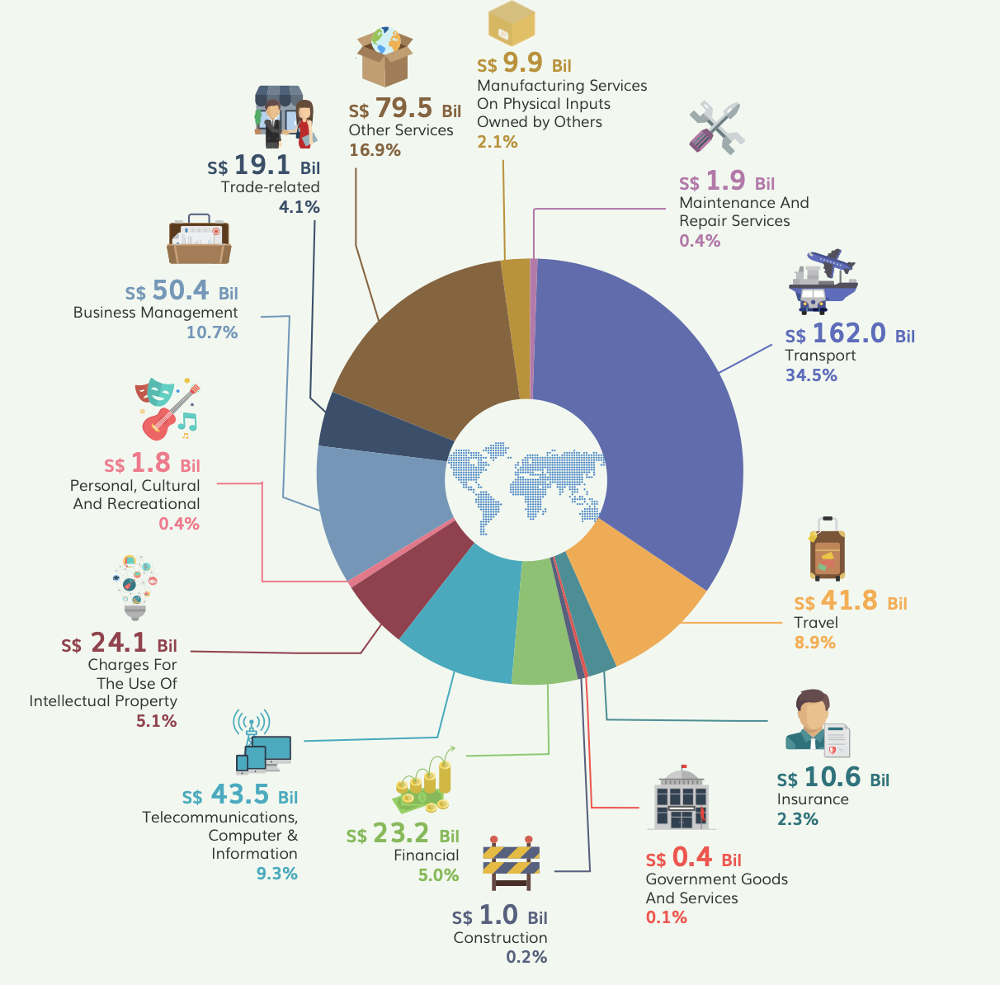

## Get Starting

```{r}
pacman::p_load(readxl, gifski, gapminder,
               plotly, gganimate,tidyverse, CGPfunctions, ggHoriPlot, tsibble, readxl, feasts, fable, seasonal, scales)
```

## Data Preparation

### Import Data

This code imports three datasets from an Excel file named **"Trade_Region_Market.xlsx"**, each from a different sheet:

-   **"T1"** → `import_m`: Contains import data

-   **"T2"** → `export_m`: Contains export data

-   **"T3"** → `re_export_m`: Contains re-export data

The `skip = 10` parameter ensures that the first **10 rows** are skipped, likely to remove headers or metadata, keeping only the relevant data.

```{r}
import_m <- read_excel("data/Trade_Region_Market.xlsx", sheet = "T1", skip = 10)
export_m <- read_excel("data/Trade_Region_Market.xlsx", sheet = "T2", skip = 10)
re_export_m <- read_excel("data/Trade_Region_Market.xlsx", sheet = "T3", skip = 10)

```

### Reshaping and Formatting Export/Import Data

-   **Pivoting Data**:

    -   Converts the dataset from a **wide format** to a **long format** using `pivot_longer()`.

    -   Keeps the **"Data Series"** column unchanged.

    -   Transforms all other columns (representing months and years) into two new columns:

        -   `"Month_Year"` → Contains the original column names (e.g., "2023 Jan").

        -   `"Export_Value"` → Stores the corresponding numerical export values.

-   **Date Conversion**:

    -   Uses `yearmonth(Month_Year)` to convert the `"Month_Year"` column into a proper **date format**, ensuring it is recognized as a **year-month** object.

```{r}
export_long <- export_m %>%
  pivot_longer(cols = -`Data Series`, names_to = "Month_Year", values_to = "Export_Value") %>%
  mutate(Date = yearmonth(Month_Year)) %>%
  select(`Data Series`, Date, Export_Value)
```

```{r}
import_long <- import_m %>%
  pivot_longer(cols = -`Data Series`, names_to = "Month_Year", values_to = "Import_Value") %>%
  mutate(Date = yearmonth(Month_Year)) %>%
  select(`Data Series`, Date, Import_Value) 

```

```{r}
#| eval: FALSE
colnames(import_m)
colnames(export_m)
colnames(re_export_m)
```

## TOTAL MERCHANDISE TRADE AT CURRENT PRICES, 2020 - 2024

### Export

This code calculates **total exports** by summing **direct exports** and **re-exports** for each year from **2020 to 2024**:

1.  **Extract & Aggregate Data**:

    -   Converts `export_m` and `re_export_m` into long format.

    -   Filters **"Total All Markets"** and extracts the **year (`YYYY`)**.

    -   Aggregates **Annual Export** and **Annual Re-Export** separately.

2.  **Compute Total Exports**:

    -   Merges **exports and re-exports** using `left_join()`.

    -   Calculates **Total Export** as:

        **Total Export=Annual Export+Annual Re-Export**

```{r}
# 計算 Export 年度總和
export_summary <- export_m %>%
  pivot_longer(cols = -`Data Series`, names_to = "Month_Year", values_to = "Export_Value") %>%
  filter(`Data Series` == "Total All Markets") %>%  # 只選擇 "Total All Markets"
  mutate(Year = as.integer(substr(Month_Year, 1, 4))) %>%  # 擷取 "YYYY" 為年份
  filter(Year >= 2020 & Year <= 2024) %>% 
  group_by(Year) %>%
  summarise(Annual_Export = sum(Export_Value, na.rm = TRUE)) %>%  # 每年加總
  arrange(Year)

# 計算 Re-Export 年度總和
reexport_summary <- re_export_m %>%
  pivot_longer(cols = -`Data Series`, names_to = "Month_Year", values_to = "ReExport_Value") %>%
  filter(`Data Series` == "Total All Markets") %>%  # 只選擇 "Total All Markets"
  mutate(Year = as.integer(substr(Month_Year, 1, 4))) %>%  # 擷取 "YYYY" 為年份
  filter(Year >= 2020 & Year <= 2024) %>% 
  group_by(Year) %>%
  summarise(Annual_ReExport = sum(ReExport_Value, na.rm = TRUE)) %>%  # 每年加總
  arrange(Year)

# 合併 Export + Re-Export
export_total_summary <- export_summary %>%
  left_join(reexport_summary, by = "Year") %>%
  mutate(Total_Export = Annual_Export + Annual_ReExport)  # 計算總出口

print(export_total_summary)  # 確保結果正確


```

### Import

```{r}

import_summary <- import_m %>%
  pivot_longer(cols = -`Data Series`, names_to = "Month_Year", values_to = "Import_Value") %>%
  filter(`Data Series` == "Total All Markets") %>%  # 這裡要加 `%>%`
  mutate(Year = as.integer(substr(Month_Year, 1, 4))) %>%  # 確保 Year 正確提取
  filter(Year >= 2020 & Year <= 2024) %>%  
  group_by(Year) %>%
  summarise(Annual_Import = sum(Import_Value, na.rm = TRUE)) %>%
  arrange(Year)  

print(import_summary)

```

### Combine both Export and Import Data

To analyze total merchandise trade, both export and import data need to be combined. This process ensures a comprehensive view of trade activities over the years.

**Merge Export and Import Data**

-   The annual **export** and **import** summaries are combined using `bind_rows()`.

-   A new column **"Type"** is added to distinguish **exports** from **imports**.

```{r}

combined_summary <- export_total_summary %>%
  rename(Value = Total_Export) %>%  
  mutate(Type = "Export") %>%
  bind_rows(
    import_summary %>%
      rename(Value = Annual_Import) %>%
      mutate(Type = "Import")
  )

print(combined_summary)  # 確保數據正確


```

### Visualizing Total Merchandise Trade

Steps in the Calculation:

1.  Group by Year → Aggregates trade data on a yearly basis.

2.  Sum Export & Import Values → Computes `Total_Trade` as the sum of both.

3.  Arrange by Year → Ensures chronological order for accurate trend analysis.

4.  Print the Data → Verifies that the calculations are correct.

```{r}
# 計算 2024 年的 Total Merchandise Trade
trade_summary <- combined_summary %>%
  group_by(Year) %>%
  summarise(Total_Trade = sum(Value, na.rm = TRUE)) %>%
  arrange(Year)

print(trade_summary)  # 確保數據正確

```

### Calculate the Change Percentage

```{r}
total_trade_summary <- trade_summary %>%
  arrange(Year) %>%  # 確保年份是遞增排序
  mutate(Change = Total_Trade - lag(Total_Trade),  # 計算變化值
         Change_Perc = round(100 * (Total_Trade - lag(Total_Trade)) / lag(Total_Trade), 1))  # 計算變化率（%）

```

### Plot Annual Merchandise Trade

(Before)

{fig-align="center"}

(After)

```{r}
ggplot(combined_summary, aes(x = Year, y = Value, fill = interaction(Year, Type))) +
  geom_col(width = 0.6, position = position_dodge2(preserve = "single")) +  # Import & Export 並排
  geom_text(aes(label = paste0(round(Value / 1000, 1), "B")), 
            position = position_dodge2(width = 0.6), vjust = -0.5, size = 3, color = "black", fontface = "bold") +

  # 折線圖：顯示 Total Merchandise Trade
  geom_line(data = total_trade_summary, aes(x = Year, y = Total_Trade, group = 1), 
            color = "black", size = 1.2, linetype = "solid", inherit.aes = FALSE) +  
  geom_point(data = total_trade_summary, aes(x = Year, y = Total_Trade), 
             size = 4, color = "red", inherit.aes = FALSE) +  
  geom_text(data = total_trade_summary, aes(x = Year, y = Total_Trade, 
                                            label = paste0(round(Total_Trade / 1000, 1), "B")), 
            vjust = -1, size = 4, fontface = "bold", color = "black", inherit.aes = FALSE) +  

  # 在折線圖上標示變化值和變化率（不標第一年）
  geom_text(data = total_trade_summary %>% filter(!is.na(Change_Perc)), 
            aes(x = Year - 0.5, y = Total_Trade + 50, 
                label = paste0(ifelse(Change_Perc >= 0, "+", ""), Change_Perc, "%"), 
                color = as.factor(Change_Perc >= 0)),  # 確保顏色設定
            size = 4, fontface = "bold", inherit.aes = FALSE) +

  # **手動設定顏色：上升綠色，下降紅色**
  scale_color_manual(values = c("TRUE" = "blue", "FALSE" = "red")) +


  # 縮小 "Total Merchandise Trade" 標籤大小，並調整位置
  annotate("text", x = 2022, y = max(total_trade_summary$Total_Trade) * 1.06, 
           label = "Total Merchandise Trade", size = 2.5, fontface = "bold", hjust = -1.5, vjust = 7, color = "black") +

  theme_minimal(base_size = 12) +
  labs(title = "Annual Merchandise Trade (2020-2024)",
       x = "Year", y = "Value (Billion S$)", fill = "Trade Type") +
  scale_x_continuous(breaks = seq(2020, 2024, 1)) +  # 確保年份顯示正確
  scale_y_continuous(labels = comma_format(scale = 1/1000), expand = expansion(mult = c(0, 0.15))) +  
  scale_fill_manual(values = c("2020.Export" = "#E57373",   
                               "2020.Import" = "#FFCDD2",   
                               "2021.Export" = "#FBC02D",   
                               "2021.Import" = "#FFF176",   
                               "2022.Export" = "#64B5F6",   
                               "2022.Import" = "#BBDEFB",   
                               "2023.Export" = "#81C784",   
                               "2023.Import" = "#C8E6C9",   
                               "2024.Export" = "#BA68C8",   
                               "2024.Import" = "#E1BEE7")) +  
  theme(
    plot.title = element_text(face = "bold", hjust = 0.5, size = 20),
    axis.text.x = element_text(face = "bold", size = 12),
    legend.position = "top"
  )


```

The updated version presents several key enhancements over the previous visualization :

**Advantages**

1.  **More Informative Representation**

    **- Added a line chart** to track **Total Merchandise Trade**, making overall trade trends clearer.

    **- Percentage change labels** highlight year-over-year growth and decline, making trade fluctuations more intuitive.

2.  **Better Data Clarity & Comparison**

    **- Side-by-side bar charts** for **exports and imports**, allowing for an easy **trade balance comparison**.

    **- Distinct colors** differentiate trade types while maintaining clarity.

3.  **Enhanced Readability**

    -   **Larger and bold labels** for key figures (e.g., total trade values).

    -   **Color-coded percentage changes** (blue for growth, red for decline) improve quick interpretation.

## **EXPORTS OF SERVICES BY SERVICES CATEGORY, 2024**

```{r}
services_data <- read_excel("data/Trade in Services.xlsx", sheet = "T1", skip = 10)
```

```{r}
services_2024 <- services_data %>%
  select(`Data Series`, `2024`) %>% 
  rename(Category = `Data Series`, Value = `2024`)  
```

### Select Categories

The given R code defines a specific set of service categories including:

**Manufacturing Services, Maintenance and Repair, Transport, Travel, Insurance, Government Goods and Services, Construction, Financial Services, Telecommunications and IT, Charges for the Use of Intellectual Property, Personal and Recreational Services, and Other Business Services**. 

```{r}
# 定義你要的類別
selected_categories <- c(
  "Manufacturing Services On Physical Inputs Owned By Others",
  "Maintenance And Repair Services",
  "Transport",
  "Travel",
  "Insurance",
  "Government Goods And Services",
  "Construction",
  "Financial",
  "Telecommunications, Computer & Information",
  "Charges For The Use Of Intellectual Property",
  "Personal, Cultural And Recreational",
  "Other Business Services"
)

# 過濾指定的類別
filtered_services <- services_2024 %>%
  filter(Category %in% selected_categories) %>%
  drop_na() %>%       # 移除 NA 值
  filter(Value > 0)   # 移除數值為 0 的行

# 查看數據
print(filtered_services)

```

### Classifying Service Trade Data into Exports and Imports

-   **Groups data by `Category` (`group_by(Category)`)**

    -   The dataset `filtered_services` is grouped by the `Category` column.

-   **Assigns a row number within each category (`mutate(Row_Number = row_number())`)**

    -   A sequential number is assigned to each row within the same category.

-   **Labels the first row as "Export" and the second as "Import" by using (`mutate(Type = ifelse(Row_Number == 1, "Export", "Import"))`)**

    -   If `Row_Number == 1`, it is labeled as `"Export"`.

    -   If `Row_Number > 1`, it is labeled as `"Import"`.

```{r}
selected_categories_NEW <- filtered_services %>%
  group_by(Category) %>%
  mutate(Row_Number = row_number()) %>%  # 每個類別的出現順序
  ungroup() %>%
  mutate(Type = ifelse(Row_Number == 1, "Export", "Import")) %>%  # 第一個當作 Export，第二個當作 Import
  select(-Row_Number)  # 移除輔助欄位

print(selected_categories_NEW)
```

```{r}
selected_categories_NEW <- selected_categories_NEW %>%
  mutate(Value = Value / 1000)
# 拆分 Export 和 Import 數據
export_data <- selected_categories_NEW %>% filter(Type == "Export")
import_data <- selected_categories_NEW %>% filter(Type == "Import")

```

### Export

(Before)

{fig-align="center"}

### Import

(Before)

{fig-align="center"}

(After)

```{r}
colors_export <- c("#1f77b4", "#ff7f0e", "#9467bd", "#d62728", "#2ca02c", "#8c564b", "#e377c2", "#7f7f7f","#6C3365", "#408080")

colors_import <- c("#17becf", "#ffbb78", "#c5b0d5" , "#ff9896","#98df8a", "#c49c94", "#f7b6d2", "#c7c7c7","#C07AB8", "#95CACA")


# Export 的圓餅圖
export_pie <- plot_ly(export_data, labels = ~Category, values = ~Value, type = 'pie',
                      textinfo = 'label+percent', hoverinfo = 'label+value+percent',
                      marker = list(colors = colors_export), hole = 0.2) %>%
  layout(title = "Exports of Services (2024)")

# Import 的圓餅圖
import_pie <- plot_ly(import_data, labels = ~Category, values = ~Value, type = 'pie',
                      textinfo = 'label+percent', hoverinfo = 'label+value+percent',
                      marker = list(colors = colors_export), hole = 0.2) %>%
  layout(title = "Imports of Services (2024)")

# 顯示兩個圖
export_pie
import_pie

```

The updated version presents several key enhancements over the previous visualization :

**Advantages**

1.  **Interactive & Dynamic** – Hover to see exact values, zoom & pan for better exploration.

2.  **Clearer Labels** – Only major segments display labels, reducing clutter.

3.  **Better Color Differentiation** – High-contrast colors make categories easier to distinguish.

## Time Series

### Data Preparation

```{r}
export_long <- export_long %>%
  mutate(Export_Value = as.numeric(Export_Value)) %>%
  filter(!is.na(Export_Value), `Data Series` != "Total All Markets")
  
```

```{r}
sum(is.na(export_long$`Data Series`))
```

### Deal with Missing value
```{r}
export_long <- export_long %>%
  mutate(Year = year(Date))  # 從 Date 提取年份
```
```{r}
export_long <- export_long %>%
  mutate(Year = factor(Year)) %>%
  filter(Year %in% c(2020, 2024)) %>%
  mutate(Year = factor(Year, levels = c(2020, 2024)))
```


```{r}
export_long_filtered <- export_long %>%
  group_by(`Data Series`, Year) %>%
  summarize(Export_Value = sum(Export_Value, na.rm = TRUE), .groups = "drop")
```


### Exterminate every column before plot Time Series

```{r}
#| eval: FALSE

table(export_long_filtered$Year, export_long_filtered$`Data Series`)

```

### **Plotting the slopegraph**

```{r}
newggslopegraph(export_long_filtered, Year, Export_Value, `Data Series`,
                Title = "Export Trends Over Time",
                SubTitle = "2020 - 2024",
                Caption = "Prepared by: Huang Tzu Ting (Hannah)",
                )
```
